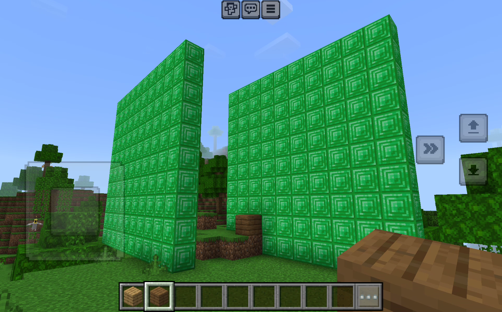

[Instructions](#instructions) | [API](#api) | [Resources](#resources)

This is a live-reloading ClojureScript websocket server for scripting Minecraft Bedrock edition.

[Here's a video showing how it works](https://www.youtube.com/watch?v=2iESpEnju1o).

# Instructions

Open the file `sandbox.cljs` in your editor.

Start the server:

```shell
cd src
npm install # you only need to run this once
npm run watch
```

This will print out the IP address the server is running on.

Connect from Minecraft (bedrock edition) in chat on your device (needs to be on the same network):

```
/connect IP-ADDRESS:3000
```

Then edit [`sandbox.cljs`](./sandbox.cljs) to add lines like this:

```clojure
(send-command "setblock ~2 ~2 ~2 emerald_block")
```

Once you save the file it will auto-reload and that will be run and the command will be sent to Minecraft.

# API

Here are all the things you can do in `sandbox.cljs`.

### (send-command "... command e.g. setblock ...")

Sends any command into minecraft, e.g.:

```clojure
(send-command "setblock ~2 ~2 ~2 emerald_block")
```

You can use this to:

* create blocks with the `setblock x y z block_name` command.
* destroy blocks with `setblock x y z minecraft:air destroy`.

You can pass in multiple strings and they will all be concatenated.

### (on event-name callback)

When an event happens like "BlockPlaced" your callback will get called with the payload data as the first argument e.g.:

```clojure
(on "BlockPlaced"
    (fn [payload]
      (js/console.log "Block created:" (aget payload "body" "block" "id"))))
```

### (on-message first-word callback)

When the player types a chat message with the first word matching `first-word` your callback will be called with the chat message parts as the frist argument, and the payload data as the second argument.

For example this will receive any message starting with the word "test" and print the rest of the message:

```clojure
(on-message
  "test"
  (fn [message payload]
    (js/console.log "got" (pr-str message))
    (js/console.log "payload" payload)))
```

You can use this in combination with `send-command` to react to player messages by building things or digging.

# Resources

Here are some documentation resources about Minecraft websocket communications.

* [Websocket command request JSON formats](https://gist.github.com/jocopa3/54b42fb6361952997c4a6e38945e306f)
* [A list of Minecraft websocket commands you can send via websocket](https://mccteam.github.io/guide/websocket/Commands.html)
* [A list of Minecraft events you can subscribe to and the raw JSON to send](https://gist.github.com/jocopa3/5f718f4198f1ea91a37e3a9da468675c)
* [Another node websocket server which can do agent control](https://github.com/railsbob/minecraft-wss)
* [JavaScript implementation of a simple websocket server that places a block](https://gist.github.com/pirosuke/1ca2aa4d8920f41dfbabcbc7dc2a669f)
