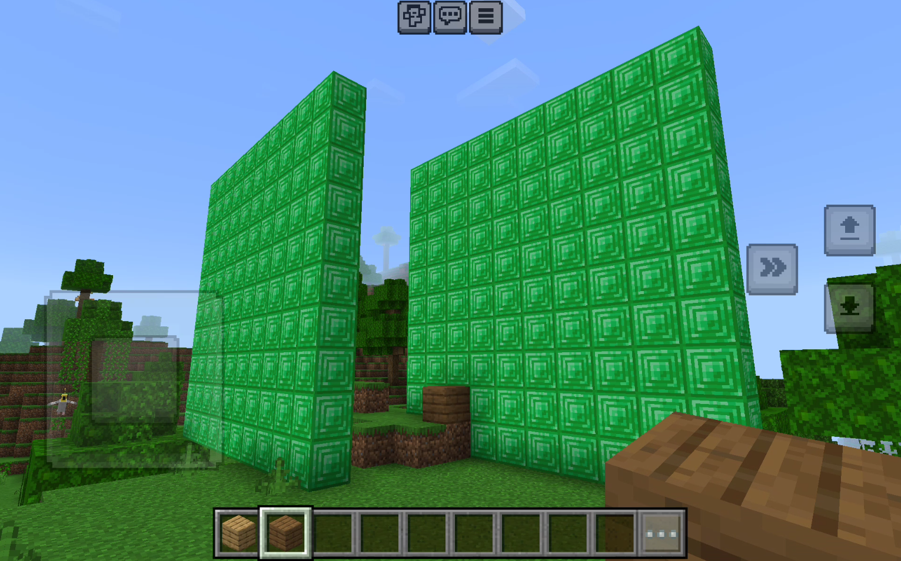

Start the server:

```
npm install
npm run watch
```

Connect from Minecraft (bedrock edition) in chat on your device:

```
/connect IP-ADDRESS:3000
```

Then edit `minerepl.cljs` to add lines like this:

```clojure
(send-command "setblock ~2 ~2 ~2 emerald_block")
```

Once you save the file it will auto-reload and that will be run and the command will be sent to Minecraft.
